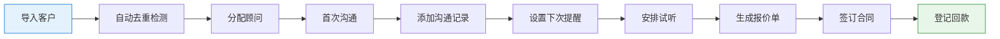
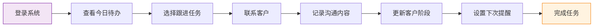

## 1. 产品概述

客户关系管理(CRM)系统，专为小型培训机构设计，用于管理咨询学员全生命周期，从线索获取到报名转化的全过程追踪。解决培训机构客户管理分散、跟进不及时、转化效率低的痛点，帮助提升客户转化率和经营效率。

## 2. 核心功能

### 2.1 用户角色
| 角色 | 注册方式 | 核心权限 |
|------|----------|----------|
| 系统管理员 | 后台创建 | 全功能访问、用户管理、数据导出 |
| 课程顾问 | 管理员创建 | 客户管理、跟进记录、任务执行 |
| 销售主管 | 管理员创建 | 数据统计、团队管理、业绩查看 |

### 2.2 功能模块
1. **客户列表**：客户导入、去重检测、多条件筛选、批量导出
2. **客户详情**：基本信息、沟通记录、跟进提醒、试听安排、报价单、合同管理
3. **跟进看板**：拖拽式成交阶段管理、顾问任务分配、阶段转化统计
4. **日程提醒**：今日待办、跟进提醒、试听安排、任务日历
5. **经营统计**：顾问转化率、来源分析、意向课程统计、业绩报表

### 2.3 页面详情
| 页面名称 | 模块名称 | 功能描述 |
|----------|----------|----------|
| 客户列表 | 导入模块 | 支持Excel/CSV批量导入，自动检测重复手机号并标记 |
| 客户列表 | 筛选模块 | 按来源、意向课程、成交阶段、跟进时间多维度筛选 |
| 客户列表 | 列表展示 | 客户基本信息、当前阶段、最近跟进、下次提醒时间 |
| 客户列表 | 导出模块 | 按筛选条件导出客户清单为Excel |
| 客户详情 | 基本信息 | 姓名、手机号、来源、意向课程、标签管理 |
| 客户详情 | 沟通记录 | 时间线展示历史沟通内容，支持新增记录 |
| 客户详情 | 跟进提醒 | 设置下次跟进时间和提醒内容 |
| 客户详情 | 试听安排 | 记录试听课程、时间、讲师、反馈 |
| 客户详情 | 报价单 | 生成课程报价，记录报价历史 |
| 客户详情 | 合同回款 | 登记合同信息、回款计划和实际回款记录 |
| 跟进看板 | 阶段看板 | 线索-咨询-试听-报价-成交-流失六阶段看板 |
| 跟进看板 | 拖拽操作 | 拖拽客户卡片切换成交阶段 |
| 跟进看板 | 任务分配 | 给顾问分配客户跟进任务 |
| 跟进看板 | 阶段统计 | 各阶段客户数量和转化率 |
| 日程提醒 | 今日待办 | 展示当天所有跟进任务和试听安排 |
| 日程提醒 | 提醒列表 | 按时间轴展示所有待办事项 |
| 日程提醒 | 日历视图 | 月度日历展示任务分布 |
| 经营统计 | 转化率统计 | 各顾问客户转化率排名和趋势 |
| 经营统计 | 来源分析 | 客户来源渠道占比和转化效果 |
| 经营统计 | 课程统计 | 意向课程热度和报名转化率 |
| 经营统计 | 业绩报表 | 合同金额、回款金额统计图表 |

## 3. 核心流程

### 客户转化主流程

### 日常工作流程

## 4. 用户界面设计

### 4.1 设计风格
- **主色调**：专业蓝 #1976D2，代表信任和专业
- **辅助色**：成功绿 #388E3C、警示橙 #F57C00、危险红 #D32F2F
- **中性色**：深灰 #212121、中灰 #757575、浅灰 #F5F5F5、纯白 #FFFFFF
- **按钮风格**：圆角6px，扁平化设计，hover时轻微上浮效果
- **字体**：标题使用"Noto Sans SC"，正文使用系统字体，字号层级清晰
- **布局风格**：卡片式布局，顶部导航+左侧菜单+主内容区
- **图标风格**：使用Material Design风格图标，简洁统一

### 4.2 页面设计概述
| 页面名称 | 模块名称 | UI元素 |
|----------|----------|--------|
| 客户列表 | 顶部工具栏 | 导入按钮、筛选器组合、导出按钮、搜索框 |
| 客户列表 | 数据表格 | 斑马线、悬停高亮、重复手机号红色标记、状态标签 |
| 客户详情 | 信息卡片 | 头像、基本信息网格、标签组、快捷操作按钮 |
| 客户详情 | 时间线 | 垂直时间线展示沟通记录，区分不同类型记录 |
| 跟进看板 | 列看板 | 六列垂直看板，每列标题带计数徽章 |
| 跟进看板 | 客户卡片 | 拖拽阴影效果、客户摘要信息、状态标签 |
| 日程提醒 | 待办列表 | 时间轴布局、优先级标记、完成勾选 |
| 日程提醒 | 日历组件 | 月度视图，有任务日期高亮显示 |
| 经营统计 | 图表区域 | 折线图、柱状图、饼图组合展示 |
| 经营统计 | 数据卡片 | 关键指标卡片，带同比环比箭头 |

### 4.3 响应式
- **桌面端优先**：主内容区宽度≥1200px，支持1920px大屏展示
- **平板适配**：768px-1199px，左侧菜单可折叠，表格支持横向滚动
- **移动端**：<768px，底部导航，卡片式列表展示，简化操作流程
- **触摸优化**：按钮最小尺寸44×44px，支持滑动切换看板列

### 4.4 交互体验
- **拖拽交互**：客户卡片拖拽时显示半透明效果，目标区域高亮
- **表单交互**：实时验证，错误提示友好，自动保存草稿
- **数据加载**：骨架屏展示，分页懒加载，平滑过渡动画
- **提醒通知**：浏览器桌面通知，页面内红点提醒，声音提示（可选）
