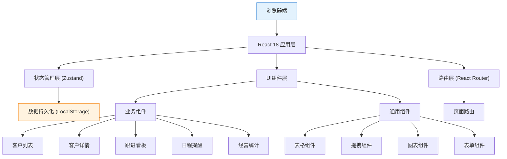
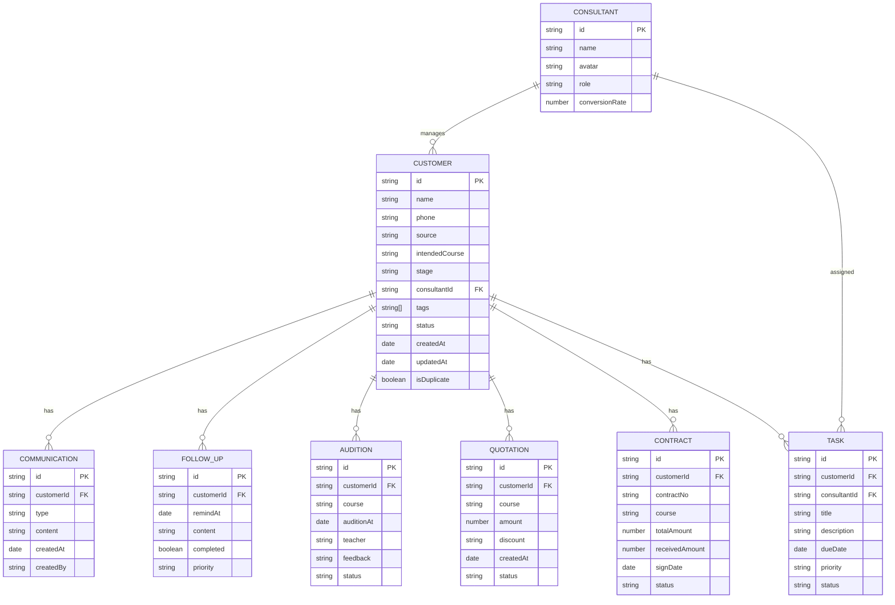

## 1. 架构设计



## 2. 技术描述

- **前端框架**：React@18.2.0 + TypeScript@5.3.0
- **构建工具**：Vite@5.0.0
- **样式方案**：TailwindCSS@3.4.0 + CSS变量
- **状态管理**：Zustand@4.4.0（轻量级状态管理）
- **路由管理**：React Router@6.20.0
- **UI组件库**：Headless UI（无样式组件）+ 自定义组件
- **图表库**：Recharts@2.10.0
- **拖拽库**：@dnd-kit/core@6.1.0 + @dnd-kit/sortable@8.0.0
- **表格库**：TanStack Table@8.11.0
- **表单处理**：React Hook Form@7.48.0 + Zod@3.22.0
- **文件处理**：xlsx@0.18.5（Excel导入导出）
- **数据持久化**：LocalStorage + IndexedDB
- **日期处理**：date-fns@3.0.0
- **图标库**：@heroicons/react@2.1.0
- **后端**：无（纯前端应用，使用Mock数据）
- **数据库**：无（LocalStorage持久化）

## 3. 路由定义

| 路由 | 页面名称 | 说明 |
|------|----------|------|
| / | 客户列表 | 默认首页，展示客户列表和筛选功能 |
| /customers | 客户列表 | 客户列表页面 |
| /customers/:id | 客户详情 | 单个客户的详细信息页面 |
| /kanban | 跟进看板 | 拖拽式成交阶段管理看板 |
| /schedule | 日程提醒 | 今日待办和日历视图 |
| /statistics | 经营统计 | 数据统计和报表展示 |
| * | 404页面 | 路由不匹配时的错误页面 |

## 4. 数据模型

### 4.1 数据模型定义



### 4.2 TypeScript 类型定义

```typescript
// 客户阶段枚举
type CustomerStage = 'lead' | 'consulting' | 'audition' | 'quotation' | 'closed' | 'lost';

// 客户来源
type CustomerSource = 'online' | 'offline' | 'referral' | 'sem' | 'social' | 'other';

// 任务优先级
type Priority = 'low' | 'medium' | 'high';

// 任务状态
type TaskStatus = 'pending' | 'in_progress' | 'completed';

interface Customer {
  id: string;
  name: string;
  phone: string;
  source: CustomerSource;
  intendedCourse: string;
  stage: CustomerStage;
  consultantId: string;
  tags: string[];
  status: 'active' | 'inactive';
  createdAt: string;
  updatedAt: string;
  isDuplicate: boolean;
  duplicateWith?: string;
}

interface Communication {
  id: string;
  customerId: string;
  type: 'phone' | 'wechat' | 'meeting' | 'other';
  content: string;
  createdAt: string;
  createdBy: string;
}

interface FollowUp {
  id: string;
  customerId: string;
  remindAt: string;
  content: string;
  completed: boolean;
  priority: Priority;
}

interface Audition {
  id: string;
  customerId: string;
  course: string;
  auditionAt: string;
  teacher: string;
  feedback: string;
  status: 'scheduled' | 'completed' | 'cancelled';
}

interface Quotation {
  id: string;
  customerId: string;
  course: string;
  amount: number;
  discount: string;
  createdAt: string;
  status: 'draft' | 'sent' | 'accepted' | 'rejected';
}

interface Contract {
  id: string;
  customerId: string;
  contractNo: string;
  course: string;
  totalAmount: number;
  receivedAmount: number;
  signDate: string;
  status: 'draft' | 'signed' | 'completed' | 'cancelled';
}

interface Task {
  id: string;
  customerId: string;
  consultantId: string;
  title: string;
  description: string;
  dueDate: string;
  priority: Priority;
  status: TaskStatus;
}

interface Consultant {
  id: string;
  name: string;
  avatar: string;
  role: 'admin' | 'consultant' | 'manager';
  conversionRate: number;
}
```

### 4.3 Mock 数据结构

应用将内置丰富的Mock数据，包括：
- 50+ 客户数据，覆盖各个阶段
- 200+ 沟通记录
- 50+ 跟进提醒
- 30+ 试听安排
- 20+ 报价单
- 15+ 合同记录
- 5 位顾问数据

## 5. 目录结构

```
src/
├── assets/              # 静态资源
├── components/          # 通用组件
│   ├── ui/             # 基础UI组件
│   ├── layout/         # 布局组件
│   ├── forms/          # 表单组件
│   └── charts/         # 图表组件
├── pages/              # 页面组件
│   ├── CustomerList/
│   ├── CustomerDetail/
│   ├── Kanban/
│   ├── Schedule/
│   └── Statistics/
├── store/              # Zustand状态管理
│   ├── customerStore.ts
│   ├── kanbanStore.ts
│   ├── scheduleStore.ts
│   └── statisticsStore.ts
├── types/              # TypeScript类型定义
├── utils/              # 工具函数
│   ├── excel.ts        # Excel导入导出
│   ├── date.ts         # 日期处理
│   └── validation.ts   # 数据验证
├── data/               # Mock数据
├── hooks/              # 自定义Hooks
├── App.tsx
├── main.tsx
└── index.css
```

## 6. 核心功能实现方案

### 6.1 客户导入与去重
- 使用xlsx库解析Excel/CSV文件
- 基于手机号进行去重检测，使用Set数据结构O(1)时间复杂度
- 导入时实时显示进度条和重复数据标记

### 6.2 拖拽看板
- 使用@dnd-kit实现流畅的拖拽交互
- 拖拽结束后更新客户阶段并记录沟通日志
- 支持跨设备拖拽状态同步（LocalStorage）

### 6.3 数据导出
- 按当前筛选条件导出Excel
- 支持选择导出字段
- 导出文件包含格式美化（列宽、颜色标记）

### 6.4 提醒通知
- 使用setInterval实现前端定时器
- 支持浏览器桌面通知（Notification API）
- 页面内红点提醒和声音提示

### 6.5 数据统计
- 使用Recharts绘制各类图表
- 数据聚合在前端计算，使用useMemo优化性能
- 支持按时间范围筛选统计数据
